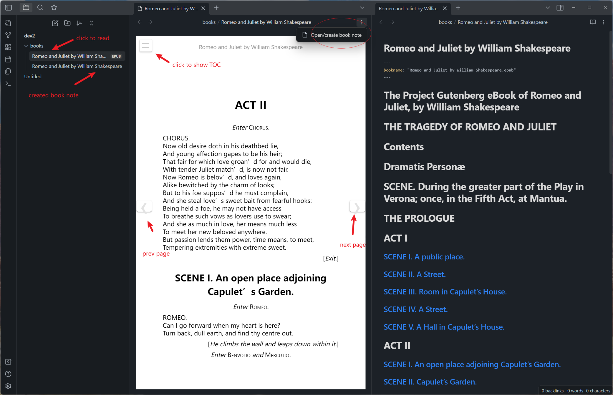

# Awesome Reader

Make Obsidian a proper Reader.

## Features

- 💾 Remember reading progress and sync to all devices. You can now continue reading where you left off across all
  devices.
- ✒ Create book note from TOC(table of contents). With well organized heading formats.
- ♳ Support multiple ebook formats. Currently, epub and pdf are supported.

## How to use

You may want to toggle on `Detect all file extensions` first in `options -> Files & Links`.

1. Drop some ebooks(e.g. epub files) to your vault. Click it and read.
2. To create book note, click `Open/create book note` from file menu. Note will be in the same folder alongside the
   book.
3. Reading progress is automatically remembered in plugin's folder. And will be sync to all devices if you got "Obsidian
   Sync" or similar services.

## Known issues

- Reading progress of pdf format is not fully implemented now

## Attribution

Special thanks to caronchen's
marvelous [Obsidian ePub Reader Plugin](https://github.com/caronchen/obsidian-epub-plugin),
some code is from this great work.
